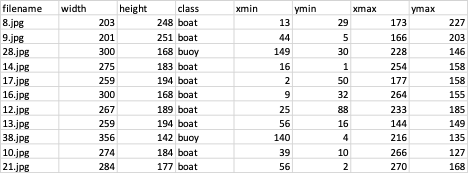

# Pytorch-SSD for Marine Objects 
The objective of this project is to identify marine objects using pytorch-ssd. This marine SSD repository was inspired by Dusty Franklin’s (@dusty-nv) pytorch-ssd GitHub repository found at the following link:

https://github.com/dusty-nv/pytorch-ssd

This is a Single Shot MultiBox Detector using MobilNet. We basically followed his example as was documented at the time and I still documented at the following link. 

https://github.com/qfgaohao/pytorch-ssd

The models and vision subdirectories are not included here in this GitHub repository and can be copied from the @dusty-nv pytorch-ssd repository if needed or downloaded from the link below. 

We have also placed 256MB of data on AWS:

https://cbpetro.s3.us-east-2.amazonaws.com/api/download/pytorch-ssd-marine-data-models-vision.zip

This zip file has the following data:

		/data/open_images/.....    # This is the open_images dataset
		/data/models/....          # This is the models sub directory that should be removed and placed in pytorch-ssd-marine
		/data/vision/....          # This is the vision subdirectory that should be removed and placed in pytorch-ssd-marine

The /data/open_images/... is the dataset with training, test and validation images and appropriate .csv files. Please place the /data/open_images/... under your ~/home directory on the Jetson. The /models/... are the models (including training data) and /vision/... folders should be removed from data and placed in the downloaded pytorch-ssd-marine subdirectory.   

## Labelimg:
We first started with labelimg where we downloaded from the following source:

https://github.com/tzutalin/labelImg

We created rectangular boxes or labels for all the marine objects (boats and buoys) found in each image using labelimg in the PascalVOC mode. By default labelimg creates a corresponding .xml file for each image. We had 315 .jpg training images and 44 .jpg test images with their corresponding .xml files.

## xml_to_csv2.py
We downloaded a program to create a single .csv file from the .xml files for the training, test and validation subdirectories. We obtained xml_to_csv.py from the following source:

https://github.com/datitran/raccoon_dataset/blob/master/xml_to_csv.py

We used xml_to_csv.py to create a single csv file for the training and test datasets.

However, pytorch-ssd wants a sub-train-annotations-bbox.csv or a sub-test-annotations-bbox.csv file that looks like the following:

Some of the columns were obvious and some were not. The LabelName is used pytorch-ssd, but we were unsure how LabelName was created. So, we used the same labels from the gun repository but used /m/06nrc for boat and /m/0gxl3 for a buoy. In the original xml_to_csv.py program the xmin/xmax and ymin/ymax were in  pixels. It appeared that in the pytorch-ssd sub-train-annotations-bbox.csv or a sub-test-annotations-bbox.csv files, that they want a fraction of the image to define the object box label. Therefore, we wrote the xml_to_csv2.py program to calculate more of the pytorch-ssd type columns as shown above. 

#### run xml_to_csv2.py in training set subdirectories to create the csv label files as is shown below for the training set of images run on Mac:
    python xml_to_csv2.py \
    -i /Users/craig/Documents/src/pytorch-ssd/data/open_images/train \
    -o /Users/craig/Documents/src/pytorch-ssd/data/open_images/sub-train-annotations-bbox.csv
   
Still, the sub-train-annotations-bbox.csv had to be altered to conform to the true open_images format that was used in the example repository. We ran a similar script for the test and validation sets too, again altering the xmp_to_csv2.py .csv outputs to conform to the pytorch-ssd open_images requirements.  

## data open_images subdirectories
On the Jetson NX the full marine dataset should have the following structure in the home directory:

    ~/data/open_images/train/
		   /test/
		   /validate/

Where under ~/data/open_images/... we have the following .csv files. 

    sub-train-annotations-bbox.csv
    sub-test-annotations-bbox.csv
    sub-validation-annotations-bbox.csv
    class-description-bbox.csv

The class-description-bbox.csv has all of the LabelNames and descriptions for all pytorch-ssd objects including our new /m/06nrc for boat and /m/0gxl3 for a buoy that was added to this list. 

We are unsure if the sub-validation-annotations-bbox.csv file is used, but to be consistent with the examples we did supply some images with the corresponding .csv file as was used in the original example.

## Notes: The following commands were used in our processing and are shown below to be used as examples. 

### VIDEO:
    #This is pretty fast in Object Detection and near real-time
    python3 run_ssd_live_demo.py mb1-ssd models/mobilenet-v1-ssd-mp-0_675.pth models/voc-model-labels.txt '/dev/video1'  # dump core

    #Very good and runs well - best
    python3 run_ssd_live_caffe2.py models/mobilenet-v1-ssd_init_net.pb models/mobilenet-v1-ssd_predict_net.pb models/voc-model-labels.txt  '/dev/video1'

### ReTrain:
    python3 train_ssd.py --dataset_type open_images --datasets ~/data/open_images --net mb1-ssd --pretrained_ssd models/mobilenet-v1-ssd-mp-0_675.pth --scheduler    cosine --lr 0.01 --t_max 100 --validation_epochs 5 --num_epochs 20 --base_net_lr 0.001  --batch_size 5

### final train, batch is number of samples processed
    python3 train_ssd.py --dataset_type open_images --datasets ~/data/open_images --net mb1-ssd --pretrained_ssd models/mobilenet-v1-ssd-mp-0_675.pth --scheduler cosine --lr 0.01 --t_max 100 --validation_epochs 5 --num_epochs 100 --base_net_lr 0.001  --batch_size 5

### test validation. I do not see this validation set being loaded in training, but the results are near perfect
    python3 train_ssd.py --dataset_type open_images --datasets ~/data/open_images --net mb1-ssd --pretrained_ssd models/mobilenet-v1-ssd-mp-0_675.pth --validation_dataset ~/data/open_images --scheduler cosine --lr 0.01 --t_max 100 --validation_epochs 5 --num_epochs 100 --base_net_lr 0.001  --batch_size 5

### Test on Image
    python3 run_ssd_example.py mb1-ssd models/mb1-ssd-Epoch-19-Loss-2.7059561729431154.pth  models/voc-model-labels.txt ./readme_ssd_example.jpg

    python3 run_ssd_example.py mb1-ssd models/mobilenet-v1-ssd-mp-0_675.pth models/voc-model-labels.txt ./45.jpg

### run on mp4 file, works great:
    #python3 run_ssd_live_demo.py <net type>  <model path> <label path> [video file]
    python3 run_ssd_live_demo.py mb1-ssd models/mb1-ssd-Epoch-99-Loss-1.9556251300705805.pth  models/open-images-model-labels.txt ./buoy_boats.mp4

### try to use all but marine labels for objects. This works fine, but too many objects. 
    python3 run_ssd_live_demo.py mb1-ssd models/mobilenet-v1-ssd-mp-0_675.pth models/voc-model-labels.txt ./buoy_boats.mp4

    python3 run_ssd_live_demo.py mb1-ssd models/mb1-ssd-Epoch-99-Loss-1.9556251300705805.pth  models/open-images-model-labels.txt ./sail.mp4

    mb1-ssd-Epoch-99-Loss-1.9556251300705805 # this is the model from 100 epochs for marine objects

