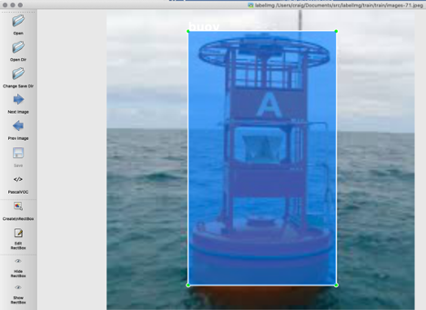

# Pytorch-SSD for Marine Objects 
The objective of this project is to identify marine objects using pytorch-ssd.

This marine SSD repository was inspired by Dusty Franklin’s (@dusty-nv) pytorch-ssd GitHub repository found at the following link:

https://github.com/dusty-nv/pytorch-ssd

This is a Single Shot MultiBox Detector using MobilNet. We basically followed this example as was documented at the time and I still shown in the following link that was used to develop this repository. 

The models and vision subdirectories should be copied from @dusty-nv repository. 

We will allow for the downloading of the marine dataset and models through AWS in the near future if requested.

https://github.com/qfgaohao/pytorch-ssd

## Labelimg:
We first started with labelimg. 

We created rectangular boxes for all the marine objects (boats and buoys) found in each image using labelimg in the PascalVOC mode. Labelimg creates a corresponding .xml file for each marine image. We had 315 .jpg training images and 44 .jpg test images.

## xml_to_csv2.py
We then used xml_to_csv.py to create a single csv file for the training set and one for the test set.

However, pytorch-ssd wants a sub-train-annotations-bbox.csv or a sub-test-annotations-bbox.csv file that looks like the following:

Some of the columns were obvious and some were not. The LabelName is used pytorch-ssd, but we were unsure how LabelName and id were labeled. So, we used the same labels from the gun repository but used /m/06nrc for boat and /m/0gxl3 for a buoy. In the original xml_to_csv.py program the xmin/xmax and ymin/ymax were pixels. It appeared that in the pytorch-ssd sub-train-annotations-bbox.csv or a sub-test-annotations-bbox.csv files, that they want a fraction of the image to define the objects. 

Therefore, we wrote the xml_to_csv2.py program that calculated more of the pytorch-ssd columns as shown above. 

#### run xml_to_csv2.py in training set subdirectories to create the csv label files as is shown below for the training set of images:
python xml_to_csv2.py \
-i /Users/craig/Documents/src/pytorch-ssd/data/open_images/train \
-o /Users/craig/Documents/src/pytorch-ssd/data/open_images/sub-train-annotations-bbox.csv

Still, the sub-train-annotations-bbox.csv had to be altered to conform to the true open_images format that was used  

## data open_images subdirectories
On the Jetson NX the full marine dataset has the following structure:

~/data/open_images/train/
		/test/
		/validate/

Where under ~/data/open_images/ we have the following .csv files. 

sub-train-annotations-bbox.csv
sub-test-annotations-bbox.csv
sub-validation-annotations-bbox.csv
class-description-bbox.csv

The class-description-bbox.csv has all of the LabelNames and descriptions for all pytorch-ssd objects including our /m/06nrc for boat and /m/0gxl3 for a buoy added to this list. 

It does not appear that the sub-validation-annotations-bbox.csv file is used, but we did have some images and the corresponding .csv file as was used in the original example.

## Notes found in attached scripts.txt file

### VIDEO:
#This is pretty fast in Object Detection and near real-time
python3 run_ssd_live_demo.py mb1-ssd models/mobilenet-v1-ssd-mp-0_675.pth models/voc-model-labels.txt '/dev/video1'  # dump core

#Very good and runs well - best
python3 run_ssd_live_caffe2.py models/mobilenet-v1-ssd_init_net.pb models/mobilenet-v1-ssd_predict_net.pb models/voc-model-labels.txt  '/dev/video1'

### ReTrain:
python3 train_ssd.py --dataset_type open_images --datasets ~/data/open_images --net mb1-ssd --pretrained_ssd models/mobilenet-v1-ssd-mp-0_675.pth --scheduler cosine --lr 0.01 --t_max 100 --validation_epochs 5 --num_epochs 20 --base_net_lr 0.001  --batch_size 5

### final train, batch is number of samples processed
python3 train_ssd.py --dataset_type open_images --datasets ~/data/open_images --net mb1-ssd --pretrained_ssd models/mobilenet-v1-ssd-mp-0_675.pth --scheduler cosine --lr 0.01 --t_max 100 --validation_epochs 5 --num_epochs 100 --base_net_lr 0.001  --batch_size 5

### test validation. I do not see this validation set being loaded in training, but the results are near perfect
python3 train_ssd.py --dataset_type open_images --datasets ~/data/open_images --net mb1-ssd --pretrained_ssd models/mobilenet-v1-ssd-mp-0_675.pth --validation_dataset ~/data/open_images --scheduler cosine --lr 0.01 --t_max 100 --validation_epochs 5 --num_epochs 100 --base_net_lr 0.001  --batch_size 5

### Test on Image
python3 run_ssd_example.py mb1-ssd models/mb1-ssd-Epoch-19-Loss-2.7059561729431154.pth  models/voc-model-labels.txt ./readme_ssd_example.jpg

python3 run_ssd_example.py mb1-ssd models/mobilenet-v1-ssd-mp-0_675.pth models/voc-model-labels.txt ./45.jpg

### run on mp4 file, works great:
#python3 run_ssd_live_demo.py <net type>  <model path> <label path> [video file]
python3 run_ssd_live_demo.py mb1-ssd models/mb1-ssd-Epoch-99-Loss-1.9556251300705805.pth  models/open-images-model-labels.txt ./buoy_boats.mp4

### try to use all but marine labels for objects. This works fine, but too many objects. 
python3 run_ssd_live_demo.py mb1-ssd models/mobilenet-v1-ssd-mp-0_675.pth models/voc-model-labels.txt ./buoy_boats.mp4

python3 run_ssd_live_demo.py mb1-ssd models/mb1-ssd-Epoch-99-Loss-1.9556251300705805.pth  models/open-images-model-labels.txt ./sail.mp4

mb1-ssd-Epoch-99-Loss-1.9556251300705805 # this is the model from 100 epochs for marine objects

